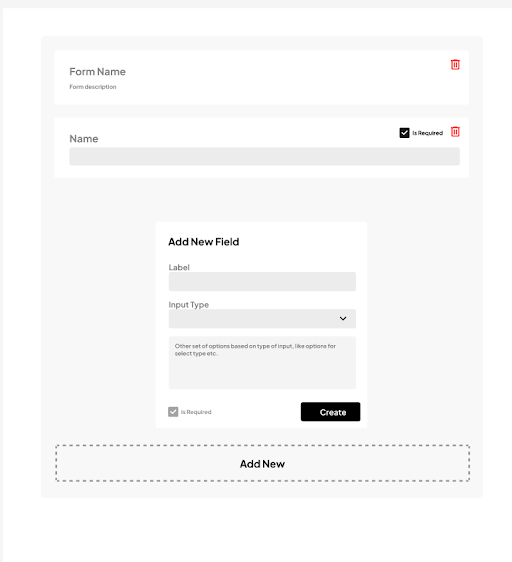

# Problem Statement:

Implement a Dynamic Form Generator and Submit it

You are tasked with creating a dynamic form generator in React.js. The form generator should allow users to define a form structure dynamically and then render the form based on the provided structure. The form structure will be defined as a JSON object, and the form should include various input types such as text inputs, checkboxes, and radio buttons.

---

## Here are the requirements for the task:

- object should support the following types of form fields:
  - Text Input
  - Textarea

- Create a React component that takes a JSON object as a prop, representing the form structure. The JSON object will contain information about form fields, their types, labels, and options (if applicable).
- The JSON checkbox
- Radio Button
- Select Dropdown
- Button
- H2 element for header
- P for description
- You will create a two pages Builder Page and a Submission Page
- You will create a form builder which will look like provided in reference image
- Clicking on add button will prompt a container when you will fill set of information
  Like its label, type, and other options.
- Creating should update the JSON data for form and it should be rendered based on it on the builder page, on creating a form you need to check validation for Form must have a header And description along with the Submit button.

On the Submission page the form should render each form field based on the information provided in the JSON object.Implement form validation for required fields. If a field is marked as required in the JSON object, the form submission should be prevented until all required fields are filled.
Handle form submission. When the user submits the form, display an alert with the form data in a readable format.
Implement a "Reset" button that clears all the form fields.
Ensure that the form layout is user-friendly and responsive.
Use appropriate React best practices and state management for this task
Implement proper error and exception handling

---

## Example JSON

```json
{
  "fields": [
    {
      "type": "text",
      "label": "Name",
      "id": "name",
      "required": true
    },
    {
      "type": "checkbox",
      "label": "Subscribe to Newsletter",
      "id": "subscribe"
    },
    {
      "type": "radio",
      "label": "Gender",
      "id": "gender",
      "options": ["Male", "Female"]
    },
    {
      "type": "select",
      "label": "Country",
      "id": "country",
      "options": ["USA", "Canada", "UK", "Other"]
    }
  ]
}
```


